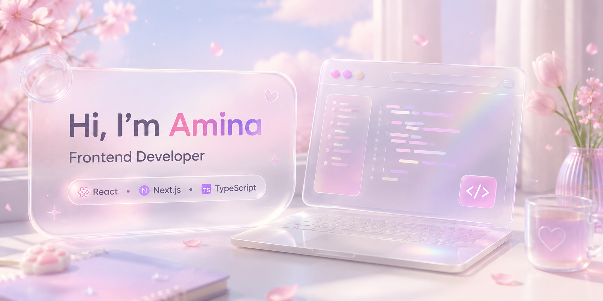

  

## 👋 About Me

Hi! I'm Amina, a frontend developer who enjoys turning ideas and UI designs into responsive, interactive, and user-friendly web experiences.

- 💻 Mostly working with React, TypeScript, Next.js, and Tailwind CSS
- 🎨 I enjoy building clean interfaces and paying attention to small UI details
- 📚 Currently learning more about frontend architecture and creating reusable components
- 🚀 Always working on personal projects to improve my skills
---

## 🛠 Tech Stack

  

---

## 🌱 Currently Learning

- Frontend Architecture
- Performance Optimization
- Advanced Next.js
- Design Systems

---

## 🚀 Featured Projects

### 🏠 Real Estate Platform

Modern real estate platform focused on responsive design and a smooth property browsing experience.

#### Tech Stack

#### Features

- 🏘️ Property search & filtering
- 🗺️ Interactive map integration
- 💬 Chat with property owners
- 🌓 Dark & Light mode
- ⚡ REST API integration
- 🚀 TanStack Query for server state management
- 📱 Fully responsive interface

**📂 Source Code:** https://github.com/next-winter-1404/nova

---

### 🎓 Online Learning Platform

A bilingual learning platform featuring AI-powered tools, dashboards, and real-time communication.

#### Tech Stack

#### Features

- 🌍 Bilingual interface
- 🤖 AI-powered assistant
- 💬 Real-time chat with admin
- 🔐 Authentication & role-based access
- 🌓 Dark & Light mode
- ⚡ REST API integration
- 🚀 Data fetching and caching with TanStack Query
- 📱 Responsive dashboard

**🔗 Live Demo:**  Programming Courses Platform https://nova-delta-flax.vercel.app/

**📂 Source Code:** ** https://github.com/react-summer-1404/Nova

---

## 📈 GitHub Activity

  

  

---

## 🤝 Connect With Me

